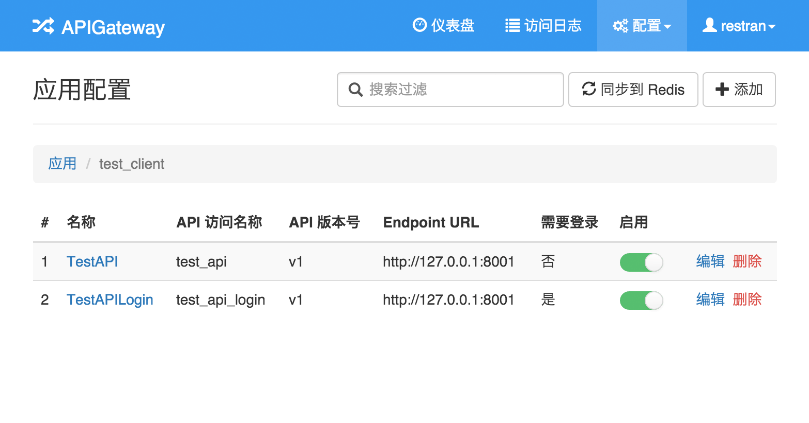
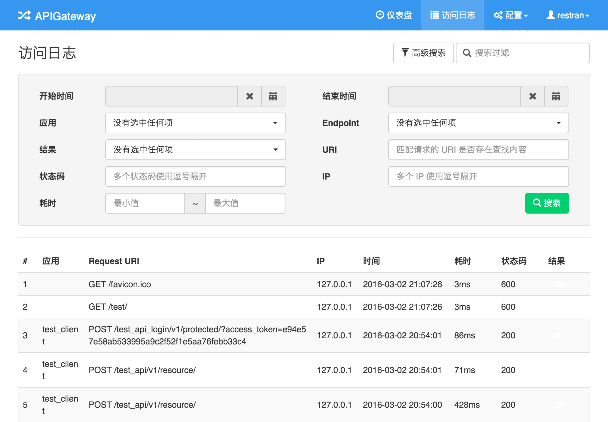

# API Gateway Dashboard

Web dashboard for [api-gateway](https://github.com/restran/api-gateway), still in development.

这是 api-gateway 项目的 Web 控制台，目前仍然在开发中。

## 页面效果

### 应用配置



### 访问日志



## 环境和依赖

目前只在 Python 2.7 环境下测试过

```
# database
redis
mysql
mongodb

# python packages
redis
django>=1.8
cerberus
requests
celery
django-celery
django-kombu
uwsgi
MySQL-python
ConcurrentLogHandler
``` 

Django 项目的部署可以参考我写的一篇博客，[CentOS 环境下基于 Nginx uwsgi 搭建 Django 站点](http://www.restran.net/2015/04/09/centos-uwsgi-nginx-django/)


# TODO

- [x] Client, API Endpoint 配置
- [x] 用户账号
- [x] 访问日志
- [x] 首页的访问统计
- [ ] IP 白名单, 黑名单配置

