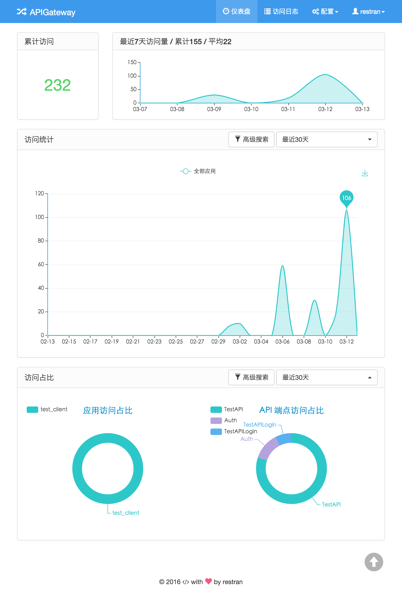
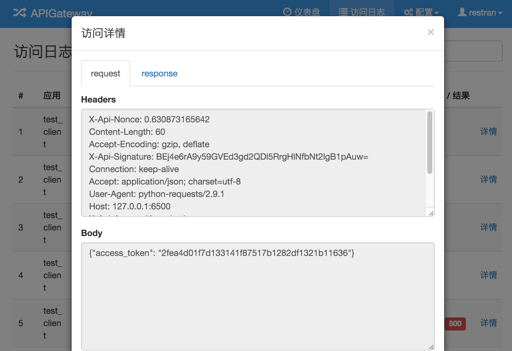

# API Gateway Dashboard

Web dashboard for [api-gateway](https://github.com/restran/api-gateway), still in development.

这是 api-gateway 项目的 Web 控制台，目前仍然在开发中。

## 页面效果

### 访问日志



### 应用配置


### 访问日志


### 日志详情



## 环境和依赖

目前只在 Python 2.7 环境下测试过

```
# database
redis
mysql
mongodb

# python packages
redis
django>=1.8
cerberus
requests
celery
django-celery
django-kombu
uwsgi
MySQL-python
ConcurrentLogHandler
``` 

## 配置文件

可以导入 json 配置文件，参考样例在 `/doc/export_config.json`

## 部署

Django 项目的部署可以参考我写的一篇博客，[CentOS 环境下基于 Nginx uwsgi 搭建 Django 站点](http://www.restran.net/2015/04/09/centos-uwsgi-nginx-django/)

### 配置

settings.py，更多配置请查看该文件

```py
# Redis 配置
REDIS_HOST = '127.0.0.1'
REDIS_PORT = 6379
REDIS_DB = 0
REDIS_PASSWORD = 'your_password'
REDIS_MAX_CONNECTIONS = 100

# MongoDB 配置
MONGO_HOST = '127.0.0.1'
MONGO_PORT = 27017
MONGO_USERNAME = 'api_gateway_user'
MONGO_PASSWORD = 'api_gateway_password'
MONGO_DBNAME = 'api_gateway'

# 访问日志，数据库保存天数，超过指定天数会删除
ACCESS_LOG_KEEP_DAYS = 60
```

### 邮件通知

账号系统实现了忘记密码邮件通知, 需要安装 Postfix, 可以参考 [Python 使用 Postfix 发送邮件](http://www.restran.net/2015/02/12/python-postfix-email/)

### 初始化数据

    python manage.py makemigrations 
    python manage.py makemigrations djkombu 
    python manage.py migrate 

### Celery

定时解析访问统计数据的任务，依赖于 Celery，推荐使用 supervisor 来管理进程。启动 beat 和 worker:

    python manage.py celery beat --loglevel=info
    python manage.py celery worker --loglevel=info

# TODO

- [x] Client, API Endpoint 配置
- [x] 用户账号
- [x] 访问日志
- [x] 首页的访问统计
- [ ] IP 白名单, 黑名单配置

